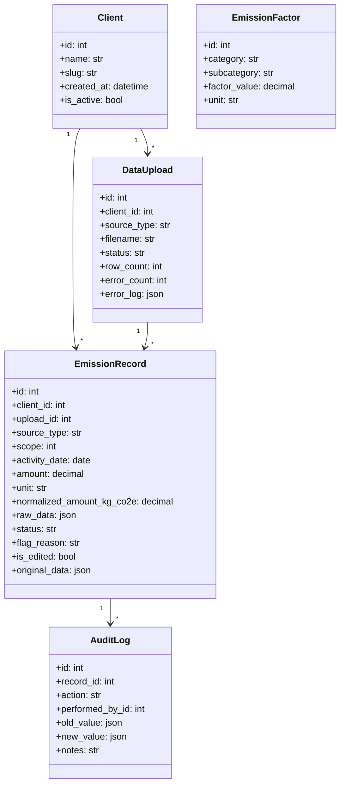

# breatheesg Carbon Accounting - Database & Calculation Model

This document outlines the Django models, data relationships, multi-tenancy design, and carbon accounting logic implemented in the breatheesg full-stack application.

---

## 1. Database Model Design & Rationale

We designed a robust relational schema using Django models to ensure complete multi-tenancy, raw data preservation, and strict audit locking.

### A. Client (Multi-Tenancy)
*   **Fields:** `id`, `name`, `slug`, `created_at`, `is_active`
*   **Rationale:** Multi-tenancy is achieved by linking a foreign key to the `Client` table on every data-owning model. This provides a hard data partition across tenants.
*   **Tenant Isolation:** All queries filter on `client` retrieved from the active tenant context (sent via the `X-Client-Slug` header or default profile) ensuring complete data boundaries.

### B. DataUpload (Pipeline Tracking)
*   **Fields:** `id`, `client`, `source_type`, `uploaded_by`, `uploaded_at`, `filename`, `status`, `row_count`, `error_count`, `error_log`
*   **Rationale:** Allows tracking imports from different ingestion channels (`SAP`, `UTILITY`, `TRAVEL`). Includes `error_log` (`JSONField`) to capture line-by-line validation errors without halting the entire import run, ensuring premium usability.

### C. EmissionRecord (Normalized Calculations Ledger)
*   **Fields:** `id`, `client`, `upload` (FK), `source_type`, `scope` (1/2/3), `activity_date`, `amount`, `unit`, `normalized_amount_kg_co2e`, `raw_data`, `status`, `flag_reason`, `reviewed_by`, `reviewed_at`, `is_edited`, `original_data`
*   **Rationale:** Represents the normalized ledger entries.
    *   **JSONField for `raw_data`:** Preserves the complete original row payload (exactly as it was written in the SAP flat file or CSV). This guarantees that even after unit conversion or edits, the original source data is never lost, supporting complete trace audits.
    *   **JSONField for `original_data`:** Holds a snapshot of the record's primary fields immediately before any manual inline modifications.
    *   **Status Controls:** Transitions from `PENDING` or `FLAGGED` to `APPROVED` or `REJECTED`. Approved states lock the data from casual modifications.

### D. AuditLog (Immutable Ledger)
*   **Fields:** `id`, `record` (FK), `action`, `performed_by` (FK), `timestamp`, `old_value` (`JSONField`), `new_value` (`JSONField`), `notes`
*   **Rationale:** Every single state change, upload, approval, or inline override triggers a record in this table. Storing updates in `old_value` and `new_value` JSON fields allows auditors to trace exactly who changed what, when, and why.

### E. EmissionFactor (Standard Reference)
*   **Fields:** `id`, `category`, `subcategory`, `factor_value`, `unit`, `source`, `valid_from`, `valid_to`
*   **Rationale:** Central reference database for conversions, ensuring that calculations are based on valid environmental factors.

---

## 2. Emission Calculations & Scope Categorization Logic

Our processing services automatically map imported rows to appropriate Scope levels and run environmental math calculations.

### Scope 1: Direct Emissions (SAP Ingest)
*   **Source:** SAP flat-file procurement sheet.
*   **Mapping:** Focuses on fuel purchases (Diesel/Petrol).
*   **Formulas:**
    1.  Convert quantities (`MENGE`) to standard Liters (`L`):
        *   `L` or `LTR` $\rightarrow$ Factor $1.0$
        *   `GAL` $\rightarrow$ Factor $3.78541$ (US Gallons)
        *   `M3` $\rightarrow$ Factor $1000.0$ (Cubic meters)
    2.  Calculate Emissions:
        $$\text{Emissions (kg CO2e)} = \text{Quantity (L)} \times \text{Emission Factor}$$
        *   *Diesel Factor:* $2.68 \text{ kg CO2e / L}$ (IPCC)
        *   *Petrol Factor:* $2.31 \text{ kg CO2e / L}$ (IPCC)

### Scope 2: Indirect Electricity (Utility Ingest)
*   **Source:** Utility CSV exports.
*   **Mapping:** Consumption values in kilowatt-hours (`kWh`).
*   **Formulas:**
    $$\text{Emissions (kg CO2e)} = \text{Consumption (kWh)} \times 0.82$$
    *   *Grid Factor:* $0.82 \text{ kg CO2e / kWh}$ (CEA India 2023 Grid Factor)

### Scope 3: Travel and Accommodation (Travel Ingest)
*   **Source:** Corporate Travel sheets.
*   **Sub-calculations:**
    1.  **Flights (AIRFARE):** Uses the **Haversine Formula** to compute straight-line distance between origin and destination IATA codes:
        $$a = \sin^2\left(\frac{\Delta \phi}{2}\right) + \cos(\phi_1)\cos(\phi_2)\sin^2\left(\frac{\Delta \lambda}{2}\right)$$
        $$c = 2 \cdot \text{atan2}\left(\sqrt{a}, \sqrt{1-a}\right)$$
        $$d = 6371.0 \times c \text{ (km)}$$
        *   *Short Haul (<1500km):* $0.255 \text{ kg CO2e / km / passenger}$
        *   *Long Haul (>=1500km):* $0.195 \text{ kg CO2e / km / passenger}$
    2.  **Hotels (HOTEL):**
        $$\text{Emissions (kg CO2e)} = \text{Nights Stayed} \times 31.2 \text{ kg CO2e / room-night}$$
    3.  **Car Rental (CAR):**
        $$\text{Emissions (kg CO2e)} = \text{Distance (km)} \times 0.192 \text{ kg CO2e / km}$$
    4.  **Rail Travel (RAIL):**
        $$\text{Emissions (kg CO2e)} = \text{Distance (km)} \times 0.041 \text{ kg CO2e / km}$$
